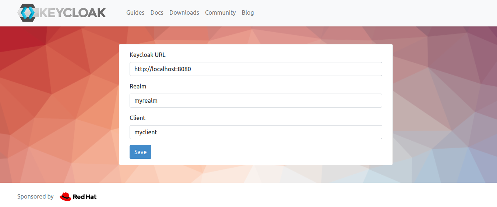

# Keycloak Docker

**Start**
- Start application on dev mode, at address: http://localhost:8080
  ```bash
  docker-compose up
  ```
**Tests**
- Create User
- Create Client
  - Set Root URL https://www.keycloak.org/app/
  - Set Valid Redirect URL https://www.keycloak.org/*
- Access: https://www.keycloak.org/app/
  - 

**References**
- https://www.keycloak.org
- https://www.youtube.com/watch?v=rgcHXpxxaZ0&t=855s&ab_channel=FullCycle